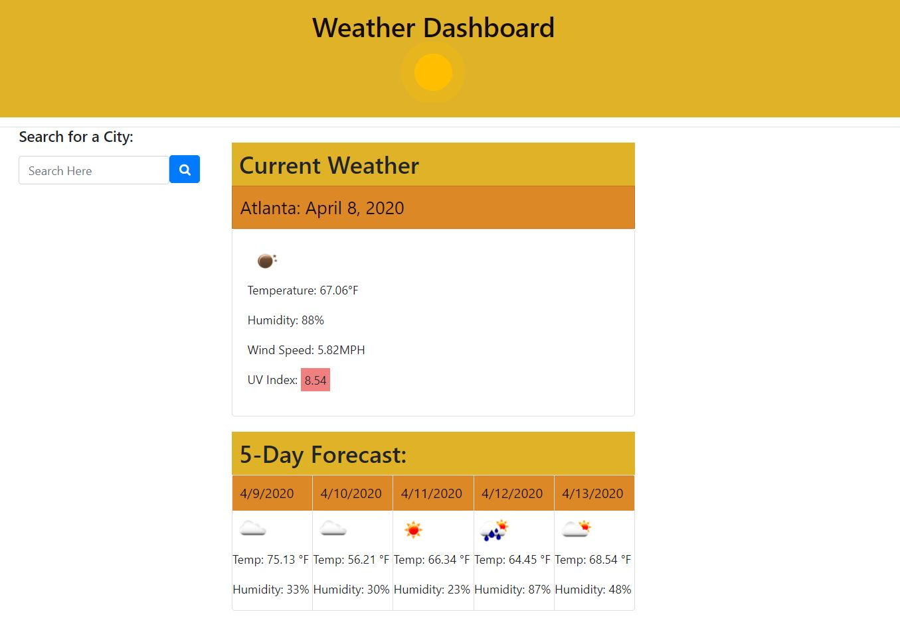

# Homework 6 Server-Side APIs: Weather Dashboard
## Creator
```
Christina Leung
https://cgleungsf.github.io/HW6_Weather/
```

## Description
```
In this app a user can search cities to view the current and five day forecast. City searches are added to a list underneath the search bar where the user can easily click and research the city they have previously searched for. City search history is saved in local storage and will show even when the user refreshes or leaves the page unless the clear button is clicked.

```

## Technologies
```
HTML
CSS
Javascript
Bootstrap
Open Weather API
moment.js
Font Awesome
```
## Challenges
```
The biggest challenge I encountered with this project was saving the previous locations searched to local storage and having the locations clickable to research the current weathe and 5 day forecast.  I also had issued with the UV index presenting different colors based on severity. 
```

## Screenshot


